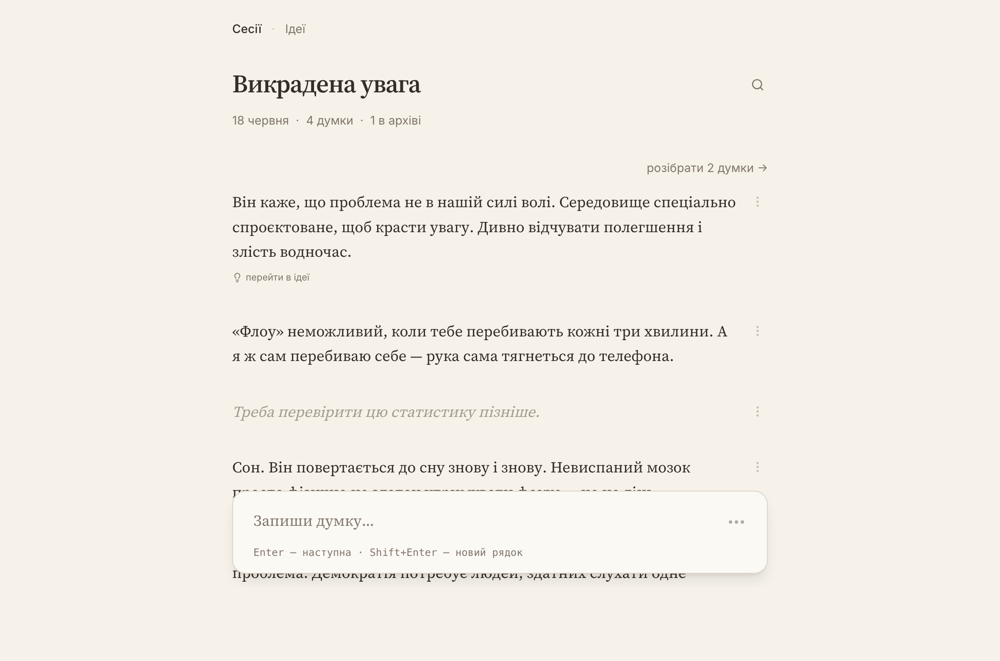
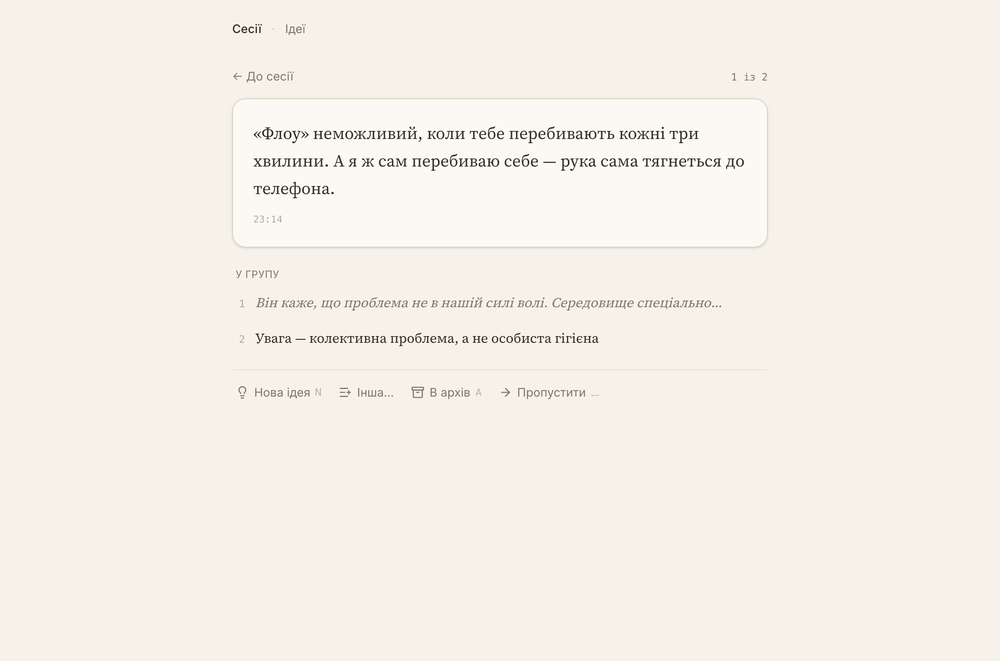
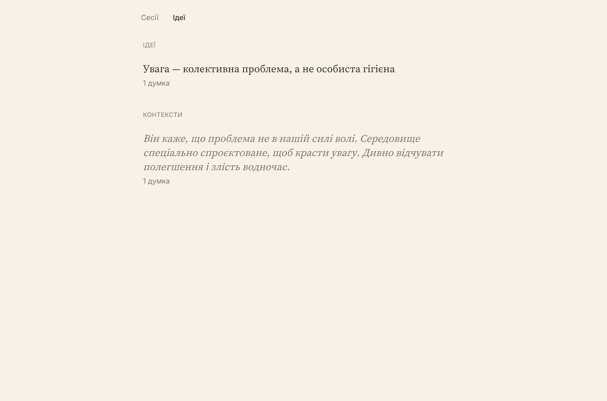
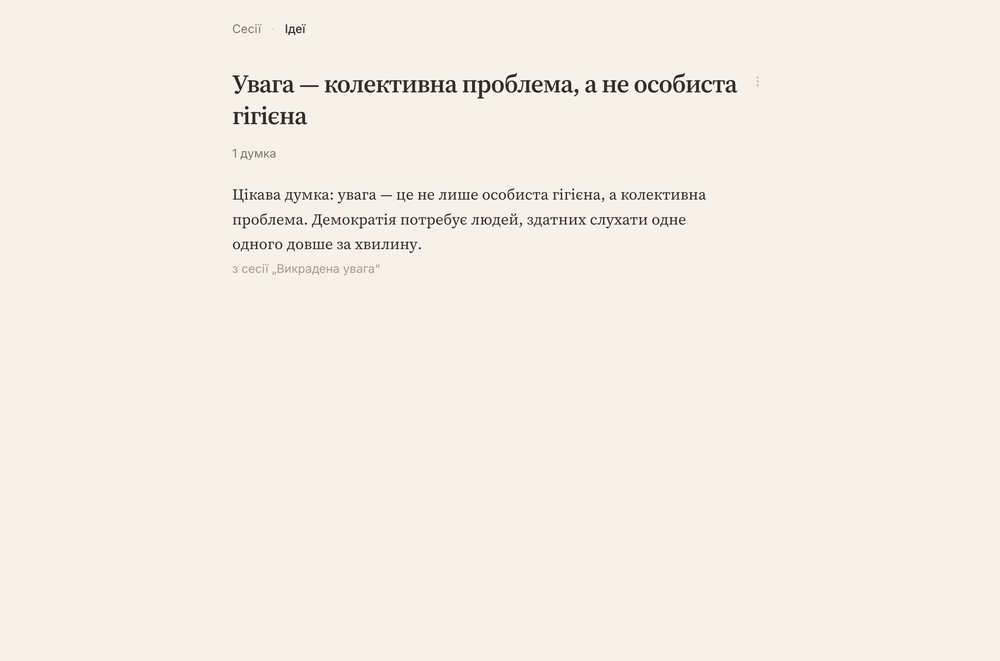
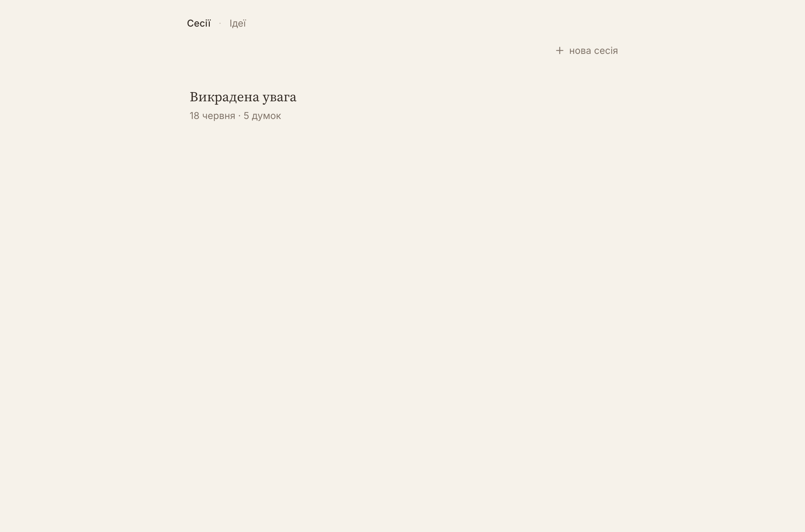

# mindnotes

Нотатник потоку думок під час читання. Читаєш книжку — накидаєш сирі думки, не
відриваючись від сторінки. Пізніше сам організовуєш їх у групи, що зріють до
ідей. AI лише асистуватиме (ще не підключений); організація — завжди твоя.

Три режими роботи:

- **Потік** — миттєве захоплення: Enter — наступна думка, маркери «тиші» між
  думками, вікно редагування 15 хв, архів.
- **Розбір** — нерозібрані думки проходяться по одній, як inbox: у групу одним
  тапом (клавіші 1–5), нова ідея, архів, пропустити.
- **Синтез** — групи на градієнті зрілості: порожня теза ⇒ «контекст» (тематична
  купка), сформульована ⇒ «ідея». Думка може живити кілька груп; крос-книжковий
  синтез — центральний сценарій.

## Скріншоти

**Потік** — сесія читання з баром захоплення внизу:



**Розбір** — думки по одній, швидкі групи під клавішами:



**Ідеї та контексти** — групи двома секціями; безтезові показуються превʼю
своєї найранішої думки:



**Сторінка ідеї** — теза-лід (редагується кліком) і думки з джерелами:



**Список сесій:**



## Запуск

Потрібні [bun](https://bun.sh) (рантайм бекенда) і [pnpm](https://pnpm.io)
(менеджер пакетів; не npm/yarn).

```bash
pnpm install
cp .env.example .env      # шляхи/порти за замовчуванням готові до роботи
pnpm db:migrate           # створити локальний SQLite-файл (apps/api/mindnotes.db)
pnpm db:seed              # опційно: демо-сесія «Викрадена увага»
pnpm dev                  # api на :3000 + web на :5173
```

## Команди

| Команда | Дія |
|---|---|
| `pnpm dev` | підняти api + web (turborepo) |
| `pnpm test` | тести: інтеграційні API (in-memory SQLite) + юніт |
| `pnpm typecheck` | tsc по всіх пакетах |
| `pnpm db:generate` | згенерувати міграцію з drizzle-схеми |
| `pnpm db:migrate` | застосувати міграції |
| `pnpm db:seed` | засіяти демо-сесію |

## Як влаштовано

Монорепо: `apps/api` (Hono на bun + drizzle + SQLite), `apps/web` (Vite + React +
tanstack router/query + tailwind), `packages/schema` (спільні zod-схеми і
drizzle-таблиці — один контракт валідується на обох боках).

Докладно — у [docs/architecture.md](docs/architecture.md).
